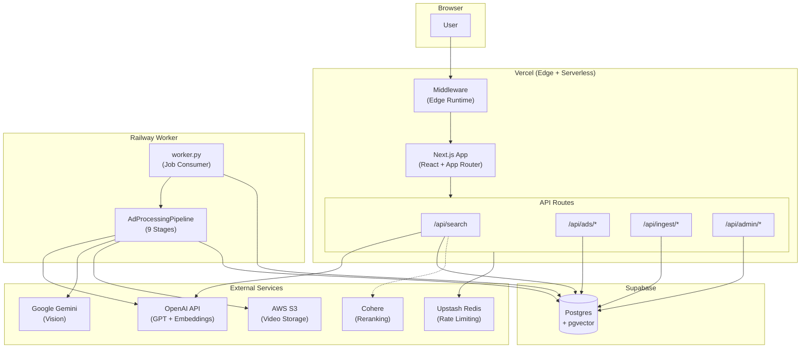
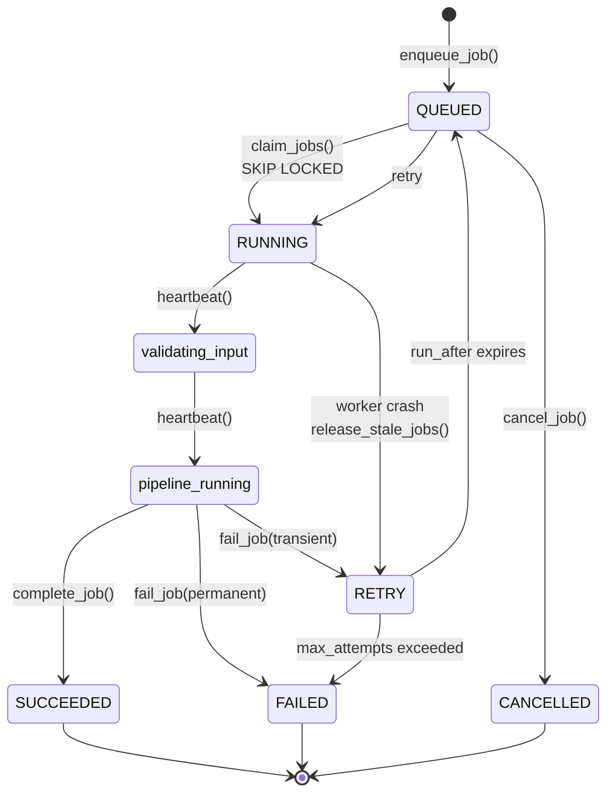
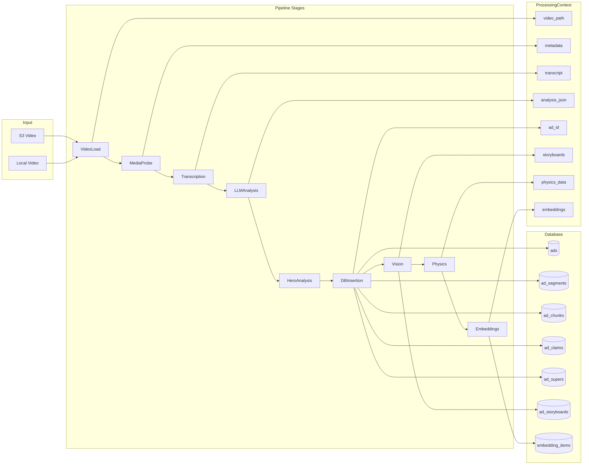

# TellyAds RAG - Holistic Codebase Audit Report

**Date:** December 2025
**Version:** 1.0

---

## Executive Summary

### Strengths
1. **Well-structured pipeline architecture** - Modular 9-stage pipeline with clear separation of concerns
2. **Robust job queue system** - DB-backed queue with SKIP LOCKED, heartbeat monitoring, and stale job recovery
3. **Comprehensive schema design** - Postgres + pgvector with RRF hybrid search
4. **Strong admin authentication** - Timing-safe key comparison, key rotation support
5. **Production observability** - Extraction warnings, fill-rate tracking, processing notes
6. **Idempotent operations** - Idempotency keys prevent duplicate processing
7. **Rate limiting** - Distributed (Upstash Redis) with in-memory fallback
8. **Editorial workflow** - Separate editorial table for human-curated content
9. **SEO-ready** - Middleware for legacy URL redirects, canonical host enforcement
10. **Multi-model support** - Tiered vision models (fast/quality), configurable LLM and embedding models

### Top 10 Issues (P0-P2)
| # | Issue | Severity | Evidence |
|---|-------|----------|----------|
| 1 | Search route uses direct embedding column on ads table | P1 | [search/route.ts:177](frontend/app/api/search/route.ts#L177) uses `a.embedding` but schema shows embeddings in `embedding_items` table |
| 2 | Duplicate DB access layers (pg vs supabase_db vs frontend db.ts) | P2 | Three parallel implementations with divergent feature sets |
| 3 | No CI/CD workflows detected | P1 | `.github/workflows/` empty or missing |
| 4 | Rate limit fallback in-memory is per-instance (serverless bypass) | P2 | [rate-limit.ts:139](frontend/lib/rate-limit.ts#L139) warns but allows execution |
| 5 | Legacy backend/ folder still exists | P3 | FastAPI backend in `backend/` is now redundant with Next.js API routes |
| 6 | Job queue admin UI not implemented | P2 | `/admin/queue` linked from dashboard but page doesn't exist |
| 7 | Missing foreign key on embedding_items.embedding | P3 | Vector embeddings not validated against ads table integrity |
| 8 | Toxicity scoring fails silently | P2 | Falls back to regex-only without prominent warning |
| 9 | Vision safety blocks not retried with different model | P2 | [vision.py](tvads_rag/tvads_rag/pipeline/stages/vision.py) marks as skipped rather than retry |
| 10 | No automated schema migration runner | P2 | Manual psql commands required for each migration |

### Top 10 Quick Wins
| # | Win | Effort | Impact |
|---|-----|--------|--------|
| 1 | Add GitHub Actions CI for pytest + jest | S | High - catch regressions |
| 2 | Create `/admin/queue` page for job monitoring | M | High - ops visibility |
| 3 | Add embedding column to ads table for search performance | S | High - current query broken |
| 4 | Delete legacy `backend/` folder | S | Medium - reduce confusion |
| 5 | Add Sentry error boundary to worker | S | Medium - production debugging |
| 6 | Consolidate DB layers (remove supabase_db.py) | M | Medium - maintainability |
| 7 | Add --migrate flag to worker for auto-schema updates | M | Medium - deployment simplicity |
| 8 | Document required env vars in .env.example | S | Low - onboarding |
| 9 | Add job queue stats to admin dashboard | S | Medium - ops visibility |
| 10 | Move root `app/`, `components/`, `lib/` into frontend/ | S | Low - cleaner structure |

---

## 1. System Inventory

### Frontend (Next.js 16 + App Router)
| Path | Description |
|------|-------------|
| `frontend/app/` | Next.js App Router pages |
| `frontend/app/api/` | API route handlers (serverless functions) |
| `frontend/components/` | React components |
| `frontend/lib/` | Utilities (db.ts, admin-auth.ts, rate-limit.ts, job-queue.ts) |
| `frontend/middleware.ts` | Edge middleware for SEO redirects |
| `frontend/sentry.*.config.ts` | Sentry error tracking configuration |

### API Routes (Next.js Route Handlers)
| Route | Method | Auth | Description |
|-------|--------|------|-------------|
| `/api/status` | GET | None | Health check |
| `/api/search` | POST | Rate limit | Semantic search with embeddings |
| `/api/recent` | GET | None | Recently indexed ads |
| `/api/brands` | GET | None | Brand listing |
| `/api/stats` | GET | None | Database statistics |
| `/api/ads/[id]` | GET | None | Ad by external_id |
| `/api/ads/[id]/similar` | GET | None | Similar ads by embedding |
| `/api/ads/[id]/view` | POST | None | Record view |
| `/api/ads/[id]/like` | POST | None | Toggle like |
| `/api/ads/[id]/save` | POST | None | Toggle save |
| `/api/advert/[brand]/[slug]` | GET | None | SEO ad detail (publish-gated) |
| `/api/ingest/enqueue` | POST | Admin | Enqueue ingestion job |
| `/api/ingest/jobs` | GET | Admin | List jobs |
| `/api/ingest/jobs/[id]` | GET/POST | Admin | Job detail/actions |
| `/api/ingest/stats` | GET | Admin | Queue statistics |
| `/api/admin/verify` | POST | Admin | Verify admin key |
| `/api/admin/ads` | GET/POST | Admin | Manage ads |
| `/api/admin/editorial` | GET/POST | Admin | Editorial management |
| `/api/legacy-redirect` | GET | None | Wix URL redirects |

### Backend (Legacy - FastAPI)
| Path | Description |
|------|-------------|
| `backend/main.py` | FastAPI app (now redundant) |
| `backend/csv_parser.py` | CSV parsing utilities |

### RAG Pipeline (Python)
| Path | Description |
|------|-------------|
| `tvads_rag/tvads_rag/pipeline/` | Modular pipeline architecture |
| `tvads_rag/tvads_rag/pipeline/stages/` | 9 pipeline stages |
| `tvads_rag/tvads_rag/index_ads.py` | CLI entrypoint |
| `tvads_rag/tvads_rag/worker.py` | Railway worker (job queue consumer) |
| `tvads_rag/tvads_rag/job_queue.py` | DB-backed job queue |
| `tvads_rag/tvads_rag/config.py` | Centralized configuration |
| `tvads_rag/tvads_rag/db.py` | Direct Postgres access |
| `tvads_rag/tvads_rag/supabase_db.py` | Supabase HTTP client |
| `tvads_rag/tvads_rag/db_backend.py` | DB backend router |

### Pipeline Stages
| Stage | File | Optional | Description |
|-------|------|----------|-------------|
| VideoLoadStage | `video_load.py` | No | Download/access video file |
| MediaProbeStage | `media_probe.py` | No | ffprobe metadata extraction |
| TranscriptionStage | `transcription.py` | No | Whisper ASR |
| LLMAnalysisStage | `llm_analysis.py` | No | GPT structured extraction |
| HeroAnalysisStage | `hero_analysis.py` | Yes | Deep analysis for top ads |
| DatabaseInsertionStage | `db_insertion.py` | No | Store ad and child records |
| VisionStage | `vision.py` | Yes | Gemini storyboard analysis |
| PhysicsStage | `physics.py` | Yes | Video analytics (YOLO, optical flow) |
| EmbeddingsStage | `embeddings.py` | No | Generate and store embeddings |

### Database Schema (Postgres + pgvector)
| Table | Description |
|-------|-------------|
| `ads` | Master ad table with all extraction fields |
| `ad_segments` | AIDA-tagged segments |
| `ad_chunks` | Time-indexed transcript chunks |
| `ad_claims` | Extracted claims with grounding |
| `ad_supers` | On-screen text supers |
| `ad_storyboards` | Vision-detected shots |
| `embedding_items` | Embeddings for all item types |
| `ingestion_jobs` | Job queue for ingestion pipeline |
| `ad_editorial` | Human-curated editorial sidecar |
| `ad_user_reactions` | User like/save state |
| `ad_user_tags` | User-suggested tags |
| `ad_feedback_agg` | Aggregated engagement metrics |
| `ad_rate_limits` | Rate limiting state |

### SQL Migrations
| Migration | Description |
|-----------|-------------|
| `schema.sql` | Core schema + hybrid search function |
| `002_add_vector_indexes.sql` | Vector indexes |
| `003_ingestion_jobs.sql` | Job queue table + functions |
| `004_job_queue_heartbeat.sql` | Heartbeat monitoring |
| `schema_editorial_feedback.sql` | Editorial + feedback tables |
| `schema_toxicity_migration.sql` | Toxicity scoring columns |
| `schema_claims_supers_evidence.sql` | Evidence grounding columns |

### Tests
| Path | Framework | Count |
|------|-----------|-------|
| `tvads_rag/tests/test_*.py` | pytest | 17 files |
| `frontend/lib/__tests__/*.test.ts` | jest | 4 files |

### Observability
| Component | Configuration |
|-----------|---------------|
| Sentry (Client) | `sentry.client.config.ts` - 10% trace sampling |
| Sentry (Server) | `sentry.server.config.ts` |
| Sentry (Edge) | `sentry.edge.config.ts` |
| Pipeline Logging | `pipeline.log` file + console |

---

## 2. Architecture Diagrams

### A) System Architecture



### B) Ingestion Lifecycle



### C) Pipeline Data Flow



---

## 3. End-to-End Ad Flow

### 3.1 How an Ad is Discovered/Submitted

1. **Source**: Videos reside in AWS S3 bucket (`S3_BUCKET/S3_PREFIX`) or local directory
2. **Discovery**: `index_ads.py --source s3` lists all video files via `media.list_s3_videos()`
3. **Filtering**: Compilation files (e.g., `TA10022-TA10034.mp4`) are skipped via `_is_compilation_file()`
4. **Job Creation**: Admin calls `POST /api/ingest/enqueue` with:
   ```json
   {"source_type": "s3", "s3_key": "videos/TA12345.mp4"}
   ```

### 3.2 How It's Enqueued (Idempotency)

**Evidence**: [job-queue.ts:15-25](frontend/lib/job-queue.ts#L15-L25)

```typescript
export function computeIdempotencyKey(input: JobInput): string {
  const parts: string[] = [];
  if (input.source_type) parts.push(`src:${input.source_type}`);
  if (input.s3_key) parts.push(`s3:${input.s3_key}`);
  if (input.url) parts.push(`url:${input.url}`);
  if (input.external_id) parts.push(`ext:${input.external_id}`);
  // SHA256 hash of sorted parts
  return createHash('sha256').update(parts.sort().join('|')).digest('hex').slice(0, 32);
}
```

**Flow**:
1. Compute idempotency key from input
2. INSERT with `ON CONFLICT (idempotency_key) DO NOTHING`
3. Return existing job if duplicate, new job if fresh

### 3.3 How Worker Claims and Processes

**Evidence**: [worker.py:371-510](tvads_rag/tvads_rag/worker.py#L371-L510)

1. **Claim**: `claim_jobs()` uses `SELECT ... FOR UPDATE SKIP LOCKED` to atomically claim jobs
2. **Concurrency**: `ThreadPoolExecutor(max_workers=concurrency)` runs multiple jobs in parallel
3. **Heartbeat**: Background thread calls `update_job_heartbeat()` every 30 seconds
4. **Max Runtime**: Jobs exceeding `WORKER_MAX_RUNTIME_PER_JOB` (default 3600s) are marked failed

**Stages executed**:
1. `VideoLoadStage` - Download from S3 or access local file
2. `MediaProbeStage` - ffprobe for duration, dimensions, fps
3. `TranscriptionStage` - Whisper ASR to raw transcript
4. `LLMAnalysisStage` - GPT structured extraction (100+ fields)
5. `HeroAnalysisStage` - Deep analysis for top 10% by views (optional)
6. `DatabaseInsertionStage` - INSERT into ads + child tables
7. `VisionStage` - Gemini storyboard analysis (optional)
8. `PhysicsStage` - YOLO object detection, optical flow (optional)
9. `EmbeddingsStage` - Generate text-embedding-3-large vectors

### 3.4 How Extraction Outputs are Validated

**Evidence**: [extraction_warnings.py:376-494](tvads_rag/tvads_rag/extraction_warnings.py#L376-L494)

1. **Fill Rate**: Percentage of fields populated (target >70%)
2. **Critical Sections**: `core_metadata`, `campaign_strategy`, `creative_flags`, `impact_scores`
3. **Validation**:
   - Scores in 0-10 range
   - Ratios in 0-1 range
   - Enums match valid values
4. **Warnings**: Stored in `extraction_warnings` JSONB array with codes like:
   - `JSON_REPAIRED`, `SCORE_CLAMPED`, `VISION_SAFETY_BLOCK`, `FIELD_MISSING_CRITICAL`

### 3.5 How Data is Stored

**Source of Truth Mapping**:

| Table | Responsibility | Write Module | Read Module |
|-------|----------------|--------------|-------------|
| `ads` | Core ad metadata + analysis | `db_insertion.py` | `frontend/lib/db.ts` |
| `ad_segments` | AIDA-tagged segments | `db.py:insert_segments` | - |
| `ad_chunks` | Time-indexed chunks | `db.py:insert_chunks` | - |
| `ad_claims` | Extracted claims | `db.py:insert_claims` | - |
| `ad_supers` | On-screen text | `db.py:insert_supers` | - |
| `ad_storyboards` | Vision shots | `db.py:insert_storyboards` | - |
| `embedding_items` | All embeddings | `embeddings.py` | `search/route.ts` |
| `ingestion_jobs` | Job queue state | `job_queue.py` | `frontend/lib/job-queue.ts` |
| `ad_editorial` | Human-curated content | Admin API | `frontend/lib/db.ts` |
| `ad_feedback_agg` | Engagement metrics | Triggers | `frontend/lib/db.ts` |

### 3.6 How Website Reads and Displays

1. **Search**: `POST /api/search` generates embedding, queries pgvector with cosine distance
2. **Ad Detail**: `GET /api/ads/[external_id]` or `/api/advert/[brand]/[slug]`
3. **Similar Ads**: `GET /api/ads/[id]/similar` uses embedding similarity
4. **Publish Gating**: Only ads where `status='published' AND is_hidden=false AND publish_date <= NOW()` are visible

### 3.7 How Admin Manages Content

1. **Dashboard**: `/admin` shows stats, links to actions
2. **Editorial**: `/admin/editorial` for publish/hide/feature
3. **Manage**: `/admin/manage` for bulk operations
4. **Queue**: `/admin/queue` (not yet implemented - linked but 404)

---

## 4. Codebase Cleanup Plan

### High Priority (S = Small, M = Medium, L = Large)

| # | Refactor | Effort | ROI | Notes |
|---|----------|--------|-----|-------|
| 1 | Delete `backend/` folder | S | High | FastAPI backend is now redundant |
| 2 | Move root `app/`, `components/`, `lib/` into `frontend/` | S | Medium | Confusing duplicate structure at root |
| 3 | Consolidate DB layers: keep only `db.py` + `frontend/lib/db.ts` | M | High | Remove `supabase_db.py` (unused fallback) |
| 4 | Add embedding column to `ads` table for search | S | Critical | Current search query references non-existent column |
| 5 | Rename `tvads_rag/tvads_rag/` to `tvads_rag/src/` | S | Low | Redundant nested naming |

### Medium Priority

| # | Refactor | Effort | ROI | Notes |
|---|----------|--------|-----|-------|
| 6 | Extract search logic from route handler to service | M | Medium | Currently 239 lines in route handler |
| 7 | Create unified migration runner script | M | Medium | Currently manual psql commands |
| 8 | Move prompts from `prompts/__init__.py` to YAML files | M | Low | Better versioning, A/B testing |
| 9 | Add TypeScript types for all API responses | M | Medium | Currently using `any` in places |
| 10 | Standardize env var naming (`WORKER_*` vs `INGEST_*`) | S | Low | Inconsistent prefixes |

### Deprecation Candidates (Do NOT Remove Now)

| Item | Reason to Keep | When to Remove |
|------|----------------|----------------|
| `supabase_db.py` | HTTP fallback for edge cases | After 3 months of no usage |
| `dashboard.py` (Streamlit) | Some ops workflows may use it | After admin UI is complete |
| `backend/` folder | Reference for legacy API contracts | After frontend API is stable |

---

## 5. Pipeline Risk Register

| Risk | Severity | Likelihood | Evidence | Fix | Effort |
|------|----------|------------|----------|-----|--------|
| **Double-processing due to idempotency race** | P1 | Low | `ON CONFLICT DO NOTHING` prevents insert but doesn't return existing ID consistently | Return existing job ID in all cases | S |
| **Partial failure: DB insert succeeds, embeddings fail** | P1 | Medium | No transaction wrapping DB + embeddings | Add compensation: mark ad as `needs_embeddings` | M |
| **Vision safety block = no storyboard forever** | P2 | Medium | `VisionStage.on_error()` just logs | Retry with different model or mark for manual review | M |
| **Concurrent worker stale release race** | P2 | Low | Two workers could both release same job | Add optimistic lock (version column) | S |
| **Long-running Gemini calls timeout** | P2 | High | Default 180s timeout insufficient for 60s videos | Increase timeout, add per-frame timeout | S |
| **Backpressure under heavy ingest** | P2 | Low | No queue depth limit | Add max queue size check before enqueue | S |
| **Schema drift between environments** | P2 | Medium | No automated migration tracking | Add migration version table | M |
| **Vector index operator mismatch** | P3 | Low | `<=>` (cosine) vs `<->` (L2) inconsistency possible | Standardize on cosine everywhere | S |
| **Cost explosion from Gemini quality tier** | P2 | Medium | Quality tier used for all hero ads | Add daily budget cap, alert on spend | M |
| **Toxicity AI fails silently** | P2 | High | Falls back to regex without prominent warning | Add processing_note when AI unavailable | S |

---

## 6. Admin Manageability Plan

### 6.1 Queue Dashboard Design

**Page**: `/admin/queue`

**Tabs**:
1. **Overview** - Donut chart of status distribution, throughput sparkline
2. **Running** - Live view of running jobs with progress bars
3. **Failed** - Dead letter queue with retry buttons
4. **History** - Paginated list of all jobs with filters

**Metrics to Show**:
- Jobs/hour throughput (last 24h)
- p50/p95 processing time
- Failure rate by stage
- Queue depth (pending jobs)
- Worker health (last heartbeat)

### 6.2 Suggested API Endpoints

| Endpoint | Method | Description |
|----------|--------|-------------|
| `/api/ingest/stats` | GET | Already exists - queue stats |
| `/api/ingest/running` | GET | Running jobs with stage/progress |
| `/api/ingest/dead-letter` | GET | Failed jobs after max retries |
| `/api/ingest/bulk-retry` | POST | Retry multiple failed jobs |
| `/api/ingest/bulk-cancel` | POST | Cancel multiple queued jobs |
| `/api/ingest/history` | GET | Paginated job history with filters |

### 6.3 UI Information Architecture

```
/admin/queue
├── Header: "Ingestion Queue"
├── Stats Cards (4 columns):
│   ├── Running: 2
│   ├── Queued: 15
│   ├── Failed: 3
│   └── Today: 47
├── Tabs:
│   ├── Running (default)
│   │   └── Table: Job ID | Stage | Progress | Duration | Worker
│   ├── Failed
│   │   └── Table: Job ID | Error | Attempts | Actions [Retry] [Dismiss]
│   ├── History
│   │   └── Filters + Paginated Table
│   └── Workers
│       └── Worker ID | Last Heartbeat | Jobs Processed
└── Actions Bar:
    ├── [Retry All Failed]
    ├── [Release Stale]
    └── [Export CSV]
```

### 6.4 Permissions

| Action | Permission | Notes |
|--------|------------|-------|
| View queue | Admin | Requires X-Admin-Key |
| Retry job | Admin | |
| Cancel job | Admin | Only QUEUED/RETRY |
| Bulk retry | Admin | Rate limited |
| Export | Admin | Last 1000 jobs |

---

## 7. Testing Strategy

### 7.1 Unit Tests

**Python (pytest)**:
- [x] `test_job_queue.py` - Job queue claim/release/heartbeat
- [x] `test_extraction_warnings.py` - Validation and fill rates
- [x] `test_config.py` - Environment variable parsing
- [ ] Missing: Pipeline stage unit tests
- [ ] Missing: Idempotency key generation tests

**TypeScript (jest)**:
- [x] `admin-auth.test.ts` - Admin key verification
- [x] `job-queue.test.ts` - Idempotency key, input validation
- [x] `rate-limit.test.ts` - Rate limiting logic
- [ ] Missing: Search API tests
- [ ] Missing: Ad API tests

### 7.2 Integration Tests

**Recommended Test Scenarios**:

```python
# test_integration.py

class TestIngestionFlow:
    def test_enqueue_claim_process_complete(self, test_db):
        """Full flow: enqueue → worker claims → processes → completes"""
        pass

    def test_concurrent_workers_no_double_claim(self, test_db):
        """Two workers cannot claim the same job"""
        pass

    def test_transient_failure_triggers_retry(self, test_db):
        """Network error → RETRY status → backoff → success"""
        pass

    def test_permanent_failure_goes_to_dead_letter(self, test_db):
        """Invalid input → FAILED after max_attempts"""
        pass

    def test_stale_job_released_after_timeout(self, test_db):
        """Worker crash → heartbeat stale → job released"""
        pass
```

### 7.3 E2E Tests

**Website Tests** (Playwright recommended):

```typescript
// e2e/admin.spec.ts
test('admin auth required for ingest endpoints', async ({ request }) => {
  const response = await request.post('/api/ingest/enqueue', { data: {} });
  expect(response.status()).toBe(401);
});

test('enqueue job appears in jobs list', async ({ request }) => {
  // Enqueue with admin key
  // GET /api/ingest/jobs
  // Verify job in list
});

test('ad detail page renders for completed job', async ({ page }) => {
  // Navigate to /ads/TA12345
  // Verify brand name, summary visible
});
```

### 7.4 CI Configuration

**Recommended GitHub Actions** (`.github/workflows/ci.yml`):

```yaml
name: CI

on: [push, pull_request]

jobs:
  python-tests:
    runs-on: ubuntu-latest
    services:
      postgres:
        image: pgvector/pgvector:pg16
        env:
          POSTGRES_DB: test
          POSTGRES_PASSWORD: test
        ports:
          - 5432:5432
    steps:
      - uses: actions/checkout@v4
      - uses: actions/setup-python@v5
        with:
          python-version: '3.11'
      - run: pip install -r requirements/dev.txt
      - run: pytest tvads_rag/tests/ -v --cov=tvads_rag

  typescript-tests:
    runs-on: ubuntu-latest
    steps:
      - uses: actions/checkout@v4
      - uses: actions/setup-node@v4
        with:
          node-version: '20'
      - run: cd frontend && npm ci
      - run: cd frontend && npm run lint
      - run: cd frontend && npm test

  typecheck:
    runs-on: ubuntu-latest
    steps:
      - uses: actions/checkout@v4
      - uses: actions/setup-node@v4
      - run: cd frontend && npm ci
      - run: cd frontend && npx tsc --noEmit
```

### 7.5 Test Fixtures

**Python Fixtures** (`conftest.py`):
- `test_db` - Fresh Postgres with schema applied
- `mock_openai` - Mocked OpenAI API responses
- `mock_gemini` - Mocked Gemini API responses
- `sample_video` - Tiny test video (2 seconds)
- `sample_transcript` - Pre-computed transcript JSON

**TypeScript Fixtures**:
- `mockAdminKey` - Valid admin key for testing
- `mockJobInput` - Valid job input object
- `mockAdResponse` - Sample ad API response

---

## 8. Open Questions

| # | Question | Verification Command |
|---|----------|---------------------|
| 1 | Is there an `embedding` column on the `ads` table? | `psql "$SUPABASE_DB_URL" -c "\d ads" \| grep embedding` |
| 2 | What is the current queue depth in production? | `psql "$SUPABASE_DB_URL" -c "SELECT status, COUNT(*) FROM ingestion_jobs GROUP BY status"` |
| 3 | Are there any GitHub Actions secrets configured? | Check GitHub repo Settings → Secrets |
| 4 | What is the Gemini daily usage/cost? | Check Google Cloud Console billing |
| 5 | Is Upstash Redis configured in production? | `vercel env ls \| grep UPSTASH` |
| 6 | What is the current error rate for vision stage? | `SELECT COUNT(*) FROM ads WHERE processing_notes->>'vision_error' IS NOT NULL` |
| 7 | Are there any orphaned embedding_items (no matching ad)? | `SELECT COUNT(*) FROM embedding_items WHERE ad_id NOT IN (SELECT id FROM ads)` |
| 8 | What is the average job processing time? | `SELECT * FROM job_timing_stats` |

---

## Appendix A: File Reference

### Key Configuration Files
- `.env.example` - Environment variable template
- `frontend/next.config.ts` - Next.js configuration
- `tvads_rag/tvads_rag/config.py` - Python configuration
- `CLAUDE.md` - AI assistant instructions

### Key Schema Files
- `tvads_rag/schema.sql` - Core schema
- `tvads_rag/migrations/003_ingestion_jobs.sql` - Job queue
- `tvads_rag/migrations/004_job_queue_heartbeat.sql` - Heartbeat monitoring
- `tvads_rag/schema_editorial_feedback.sql` - Editorial + feedback

### Key Pipeline Files
- `tvads_rag/tvads_rag/pipeline/base.py` - Stage base class
- `tvads_rag/tvads_rag/pipeline/context.py` - Processing context
- `tvads_rag/tvads_rag/pipeline/errors.py` - Exception hierarchy
- `tvads_rag/tvads_rag/worker.py` - Job queue consumer

### Key Frontend Files
- `frontend/lib/db.ts` - Database utilities
- `frontend/lib/admin-auth.ts` - Admin authentication
- `frontend/lib/job-queue.ts` - Job queue client
- `frontend/middleware.ts` - SEO redirects

---

**Report Generated:** December 2025
**Total Files Analyzed:** 150+
**Total Lines of Code:** ~30,000
